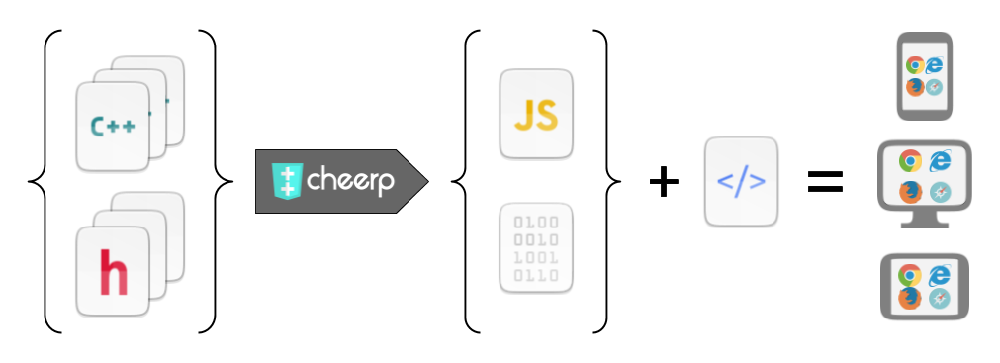

[](https://gitter.im/leaningtech/cheerp)
[](https://github.com/leaningtech/cheerp-meta/issues)
[](https://leaningtech.com/cheerp/#download)  [](Changelog)

Cheerp is an open-source, commercial C/C++ compiler for Web applications. It allows to compile virtually any C/C++ code to WebAssembly and JavaScript.

Download latest version: [](https://leaningtech.com/cheerp/#download)  [](Changelog)

Main project link: [https://leaningtech.com/cheerp/](https://leaningtech.com/cheerp/)

This repository is the main reference for documentation, issue tracking, and release notes.
The main component is on Github: [cheerp-compiler](https://github.com/leaningtech/cheerp-compiler), while other repositories are at [cheerp-newlib](https://github.com/leaningtech/cheerp-newlib), [cheerp-utils](https://github.com/leaningtech/cheerp-utils) and [cheerp-libs](https://github.com/leaningtech/cheerp-libs)

What is Cheerp
-----

Cheerp is a C/C++ compiler for the Web, based and integrated into the LLVM/clang infrastructure, and featuring numerous custom optimisation steps to maximise performance and minimise size of the compiled JavaScript/WebAssembly output. Thanks to this, Cheerp is the best performing, most optimised C++ to WebAssembly compiler available on the market.

Cheerp is used primarily to port existing C/C++ libraries and applications to HTML5, but can also be used to write high-performance Web applications and WebAssembly components from scratch. C/C++ gets optimised and compiled into JavaScript/WebAssembly, and can easily be integrated in a web page.



What is unique about Cheerp?
------

Cheerp enables C/C++ code to be compiled to a combination of WebAssembly and JavaScript (possibly asm.js when targeting legacy browsers). Compared to alternative C/C++ compilers for web applications such as Emscripten, Cheerp:

1. Generates faster WebAssembly code, but can also compile to a JavaScript output with dynamic memory (garbage-collectible output), zero-overhead DOM manipulation and access to WebApis and superior C++-JavaScript interoperability.
2. Allows to compile a single code base into a combination of WebAssembly and JavaScript by (optionally) tagging portions of the code with ```[[cheerp::genericjs]]``` and ```[[cheerp::wasm]]```.
3. Generates smaller WebAssembly outputs.

Cheerp is open-source software and is free to use for GPLv2 projects. Non-copyleft commercial licenses, commercial support and consulting packages are available from Leaning Technologies.

Get started
------

First time user? We recommend following the [Getting started](https://docs.leaningtech.com/cheerp/Getting-started#install) page, that will guide though this steps:
+ [Install](https://docs.leaningtech.com/cheerp/Getting-started#install "Install")
+ [Cheerp basics](https://docs.leaningtech.com/cheerp/Getting-started#cheerp-basics "Cheerp basics")
+ [Ready?](https://docs.leaningtech.com/cheerp/Getting-started#ready "Ready?")
+ [Hello, World!](https://docs.leaningtech.com/cheerp/Getting-started#hello-world "Hello, World!")
+ [Tutorials](https://docs.leaningtech.com/cheerp/Getting-started#tutorials "Tutorials")

Or look at the sidebar to find lots of useful materials

Bugs and Questions
------

You can get in touch with us using our [Gitter chat](https://gitter.im/leaningtech/cheerp), or by filing a bug on our [Issue tracker](https://github.com/leaningtech/cheerp-meta/issues).
